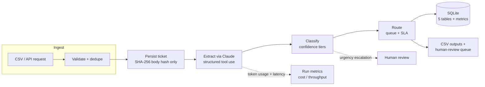

# AI Support Ticket Triage System

[](https://github.com/jaekris/support-ticket-triage/actions/workflows/ci.yml)
[](LICENSE)
[](https://www.python.org/)

**Automatically classify, prioritise, and route incoming support tickets with Claude — with confidence-based escalation, SLA deadlines, a full audit trail, and a cost/throughput readout on every run.**

Run it two ways: as a **REST service** (`POST /triage`) you can drop in front of an existing helpdesk, or as a **batch pipeline** over a CSV of tickets. Bring your own Anthropic API key — nothing is hard-coded, and the app starts and serves health checks even before a key is configured.

> **Why it matters:** support teams spend hours hand-sorting tickets. This routes each one to the right queue in ~one LLM call, escalates the genuinely urgent ones to a human, and tells you exactly what it cost. Misroutes are bounded by a confidence gate, not hoped away.

---

## Architecture



**Confidence tiers** decide how much to trust each classification:

| Tier | Confidence | Action |
|------|-----------|--------|
| `AUTO_ROUTE`   | ≥ 0.85       | Routed automatically |
| `SOFT_ROUTE`   | 0.60 – 0.85  | Routed, but escalated to human review if urgency phrases appear |
| `HUMAN_REVIEW` | < 0.60 or failed extraction | Sent to the human-review queue |

---

## Features

- **LLM classification via structured tool use** — Claude returns a guaranteed JSON schema (category, priority, sentiment, confidence, urgency indicators), no brittle text parsing.
- **Confidence-gated routing** — high-confidence tickets auto-route; uncertain ones escalate to humans. Urgency phrases like "production is down" force escalation even mid-confidence (robust word-level matching, not exact-string).
- **SLA assignment** — per-category, per-priority deadlines computed for every ticket.
- **Cost & throughput metrics** — token usage, latency, tickets/sec, and estimated USD cost per run and per ticket, persisted to SQLite.
- **Concurrent batch processing** — bounded thread pool over a shared client (`MAX_CONCURRENCY`), order-preserving.
- **Privacy by design** — the raw ticket body is **never** stored (SHA-256 hash only) and never written to logs or API responses.
- **Full audit trail** — per-stage and per-ticket events in SQLite plus a flat log file.
- **Two entrypoints** — FastAPI service and batch CLI, sharing one classification core.

---

## Quickstart

```bash
pip install -e ".[dev]"      # or: pip install -r requirements.txt
cp .env.example .env         # then add your ANTHROPIC_API_KEY
```

### Run as a service

```bash
make serve                   # uvicorn app:app --port 8000
```

```bash
curl -s localhost:8000/healthz
# {"status":"ok"}

curl -s -X POST localhost:8000/triage \
  -H "content-type: application/json" \
  -d '{"subject":"VPN down","body":"Cannot connect and our release is blocked","source":"web"}'
```

```jsonc
{
  "ticket_id": "f1c2…",
  "extraction":  { "category": "IT Support", "priority": "high", "confidence": 0.93, … },
  "classification": { "routing_tier": "AUTO_ROUTE", "requires_human_review": false, … },
  "routing": { "assigned_queue": "IT Support Team", "sla_hours": 8, "sla_deadline": "…", … }
}
```

`/healthz` works with no key; `/triage` returns a clear `503` until `ANTHROPIC_API_KEY` is set, and `422` on invalid input.

### Run as a batch pipeline

```bash
make run                     # python main.py
```

Generates 50 synthetic tickets (if no input CSV exists), triages them, and writes:

- `data/outputs/processing_results.csv` — every ticket with its routing decision
- `data/outputs/human_review_queue.csv` — low-confidence / escalated tickets
- `data/triage.db` — SQLite (tickets, extractions, classifications, routing_decisions, audit_log, run_metrics)
- `data/outputs/audit/pipeline.log` — flat audit log

The run ends with a metrics summary:

```
Run metrics
  tickets=50 ok=50 failed=0
  tiers: AUTO=38 SOFT=7 HUMAN=5
  tokens: in=61240 out=9180
  latency: avg=512ms total=25600ms
  throughput: 9.41 tickets/sec over 5.3s
  est. cost: $0.1071 total ($0.00214/ticket)
```

### Run in Docker

```bash
docker compose up --build    # reads ANTHROPIC_API_KEY from your environment
```

The key is injected at runtime — never baked into the image.

---

## Design decisions

- **Structured tool use over free-text prompting.** Forcing a `triage_ticket` tool call guarantees a valid, typed result every time and removes parsing failures from the hot path.
- **Confidence tiers instead of blind automation.** The business cost of a misroute is real, so the model's own confidence gates whether a human sees it. Urgency escalation is a second safety net for the mid-confidence band.
- **Hash-only body storage.** Support tickets contain PII. Storing only a SHA-256 hash keeps the audit trail (dedup, traceability) without retaining sensitive content — and the API never echoes the body back.
- **One classification core, two delivery surfaces.** The service and the batch pipeline call the same extract → classify → route functions, so behaviour can't drift between them.
- **Cost is a first-class output.** Token usage and latency are captured per call and aggregated, because "how much will this cost at our volume?" is the first question a buyer asks.

---

## Project structure

```
support-ticket-triage/
├── app.py                 — FastAPI service (/healthz, /readyz, /triage)
├── main.py                — batch pipeline orchestrator
├── src/
│   ├── models.py          — TypedDict contracts
│   ├── config.py          — env-driven config; lazy API-key enforcement
│   ├── prompts.py         — system prompt + triage tool schema
│   ├── extractor.py       — Anthropic call, retries, concurrency
│   ├── classifier.py      — confidence tiers + urgency escalation
│   ├── router.py          — queue + SLA assignment
│   ├── metrics.py         — cost / latency / throughput aggregation
│   ├── database.py        — SQLite schema + inserts
│   ├── audit.py           — stage + event logging
│   ├── ingestion.py       — CSV load, validation, dedupe
│   ├── data_generator.py  — synthetic ticket generation
│   └── output.py          — CSV writers
├── tests/                 — 50 tests, no API key required (LLM fully mocked)
├── Dockerfile · docker-compose.yml · Makefile · pyproject.toml
└── .github/workflows/ci.yml — ruff + mypy + pytest
```

---

## SLA table

| Category           | Critical | High | Medium | Low  |
|--------------------|----------|------|--------|------|
| IT Support         | 4h       | 8h   | 24h    | 48h  |
| Billing            | 2h       | 4h   | 8h     | 24h  |
| Technical Support  | 1h       | 4h   | 24h    | 72h  |
| Account Management | 2h       | 4h   | 8h     | 24h  |

---

## Development

```bash
make check        # ruff + mypy + pytest
make test         # pytest only
make lint         # ruff
make typecheck    # mypy
```

All tests mock the Anthropic API — **no API key required** to run the suite, and CI runs the full gate on every push.

---

## About this project

Built to be read: typed contracts, a single classification core behind two delivery surfaces, CI, containerisation, and cost observability baked in.

## License

[MIT](LICENSE)
